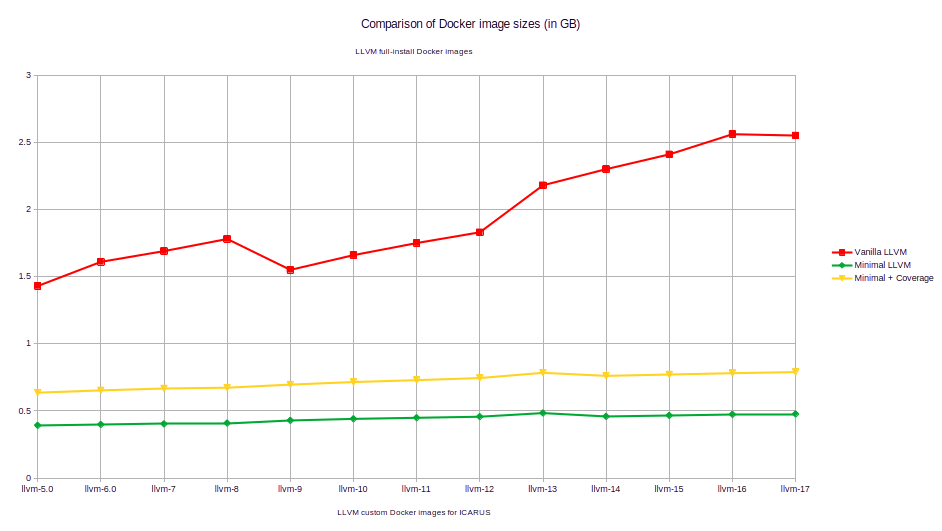

# Docker build scripts

This directory contains the docker build scripts used to build the GitHub Actions CI images.

## Usage

The build script can be called from anywhere. You can specify the `--llvm-version` option more than once.

```bash
./build.sh -j 8 -t clang --llvm-version 16 --llvm-version 17
```
The above invocation would build two Docker images with LLVM 16 and 17 installed, according to the required libraries we
need to build the **icarus** project. The images repository and tag can also be specified (via the `-r` and `-t` option,
respectively.) For the above invocation, the images generated would be `croemheld/icarus-ci:clang-16` and
`croemheld/icarus-ci:clang-17`.

You can get a list of all options with `./build.sh --help`.

## Reasons for a custom LLVM installation

There are two main reasons for providing Docker images with a custom LLVM installation.

- **Minimal working example**: With only a handful of necessary libraries to be installed, we can identify the potential
  problems faster since there are fewer locations to look into.
- **Docker image size reduction**: The LLVM libraries take up a large amount of space on the disk and also in the images
  due to the sheer number of libraries and other binaries to be installed. By only installing the required libraries for
  the **icarus** project, we can significantly reduce the image sizes.

> **Note**: An incomplete LLVM installation is usually not a good idea if other programs rely on libraries that were not
> installed by these build scripts. Therefore, treat with caution.

## Docker image size comparison

Below is a graph which displays the Docker image sizes for a full LLVM installation (red) building only the `clang` and
some of the `clang-tools-extra` targets, and two custom LLVM builds based on the required libraries for the **icarus**
project. The first one (green) depicts the size of the uncompressed Docker image with only the required LLVM libraries
installed, while the second (yellow) also includes the [compiler-rt Runtime Library](https://compiler-rt.llvm.org/) as well as additional system
and pip3 packages required for the code coverage tool `gcovr`.



The custom LLVM builds required for the **icarus** project only require between 20% and 50% of space compared to
the full LLVM installation. In addition, we now also have everything present for additional analysis of **icarus**,
such as a code coverage tool as well as a 

## Full LLVM installation

Since we also want to have code coverage reports using the [compiler-rt Runtime Library](https://compiler-rt.llvm.org/),
we need a full LLVM installation. This is because the runtime library is built using `llvm-config`, which collects the
previously built libraries. If a single library is not installed on the system, the build process fails.

It might be possible to make `llvm-config` think that all installed libraries are in fact thecomplete collection of LLVM
libraries that exist.
